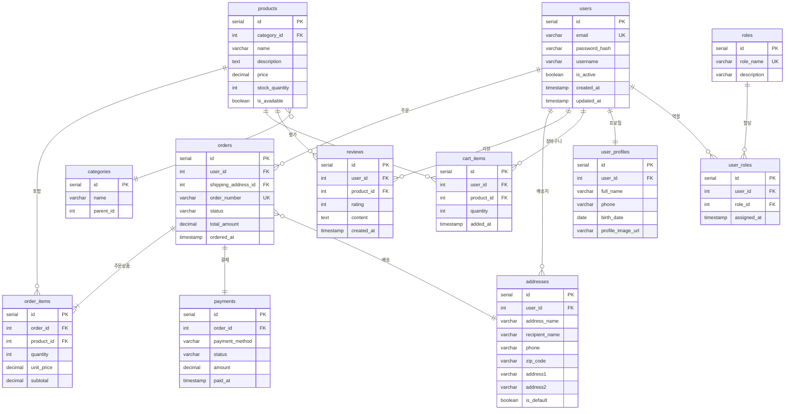

# 🛒 ShopEasy - 온라인 쇼핑몰 서비스

## 서비스 소개

**ShopEasy**는 사용자가 상품을 검색하고, 장바구니에 담고, 주문 및 결제까지 할 수 있는 온라인 쇼핑몰 플랫폼입니다.

### 주요 기능

| 기능 | 설명 |
|------|------|
| **회원 관리** | 회원가입, 로그인, 프로필 관리, 배송지 관리 |
| **상품 탐색** | 카테고리별 상품 조회, 검색, 상세 정보 확인 |
| **장바구니** | 상품 담기, 수량 변경, 삭제 |
| **주문/결제** | 주문서 작성, 배송지 선택, 결제 처리 |
| **리뷰 시스템** | 구매한 상품에 대한 별점 및 리뷰 작성 |
| **관리자 기능** | 상품 등록/수정, 주문 상태 관리, 회원 관리 |

---

## 사용자 시나리오

```
1. 회원가입 → 로그인
2. 상품 검색 및 카테고리 탐색
3. 원하는 상품 장바구니에 담기
4. 장바구니에서 수량 조절
5. 주문하기 → 배송지 선택/입력
6. 결제 진행
7. 주문 완료 → 배송 추적
8. 상품 수령 후 리뷰 작성
```

---

## ERD (Entity Relationship Diagram)



---

## 테이블 상세 설명

### 1. users (사용자)
사용자 계정 정보를 저장하는 핵심 테이블

| 컬럼 | 타입 | 설명 |
|------|------|------|
| id | SERIAL | 기본키 (자동 증가) |
| email | VARCHAR | 이메일 (로그인 ID, 유니크) |
| password_hash | VARCHAR | 암호화된 비밀번호 |
| username | VARCHAR | 닉네임 |
| is_active | BOOLEAN | 계정 활성화 여부 |
| created_at | TIMESTAMP | 가입일시 |
| updated_at | TIMESTAMP | 정보 수정일시 |

### 2. user_profiles (사용자 프로필)
사용자의 상세 정보 (users와 1:1 관계)

| 컬럼 | 타입 | 설명 |
|------|------|------|
| id | SERIAL | 기본키 |
| user_id | INT | users 외래키 |
| full_name | VARCHAR | 실명 |
| phone | VARCHAR | 전화번호 |
| birth_date | DATE | 생년월일 |
| profile_image_url | VARCHAR | 프로필 이미지 경로 |

### 3. addresses (배송지)
사용자별 배송지 목록 관리

| 컬럼 | 타입 | 설명 |
|------|------|------|
| id | SERIAL | 기본키 |
| user_id | INT | users 외래키 |
| address_name | VARCHAR | 배송지 별칭 (예: 집, 회사) |
| recipient_name | VARCHAR | 수령인 이름 |
| phone | VARCHAR | 수령인 연락처 |
| zip_code | VARCHAR | 우편번호 |
| address1 | VARCHAR | 기본 주소 |
| address2 | VARCHAR | 상세 주소 |
| is_default | BOOLEAN | 기본 배송지 여부 |

### 4. roles & user_roles (역할 관리)
사용자 권한 관리 (다대다 관계)

**roles**: admin, user, seller 등 역할 정의
**user_roles**: 사용자-역할 매핑 테이블

### 5. products (상품)
판매 상품 정보

| 컬럼 | 타입 | 설명 |
|------|------|------|
| id | SERIAL | 기본키 |
| category_id | INT | 카테고리 외래키 |
| name | VARCHAR | 상품명 |
| description | TEXT | 상품 설명 |
| price | DECIMAL | 가격 |
| stock_quantity | INT | 재고 수량 |
| is_available | BOOLEAN | 판매 가능 여부 |

### 6. categories (카테고리)
상품 카테고리 (셀프 조인으로 계층 구조)

| 컬럼 | 타입 | 설명 |
|------|------|------|
| id | SERIAL | 기본키 |
| name | VARCHAR | 카테고리명 |
| parent_id | INT | 상위 카테고리 (NULL이면 최상위) |

예시:
```
전자제품 (parent_id: NULL)
  ├── 노트북 (parent_id: 1)
  ├── 스마트폰 (parent_id: 1)
  └── 태블릿 (parent_id: 1)
```

### 7. cart_items (장바구니)
사용자별 장바구니 상품

### 8. orders (주문)
주문 헤더 정보

| 컬럼 | 타입 | 설명 |
|------|------|------|
| id | SERIAL | 기본키 |
| user_id | INT | 주문자 |
| shipping_address_id | INT | 배송지 |
| order_number | VARCHAR | 주문번호 (예: ORD-20241201-001) |
| status | VARCHAR | 주문상태 (pending/paid/shipping/delivered/cancelled) |
| total_amount | DECIMAL | 총 결제금액 |
| ordered_at | TIMESTAMP | 주문일시 |

### 9. order_items (주문 상품)
주문별 상품 상세 (주문:상품 = 1:N)

### 10. payments (결제)
결제 정보 (주문당 1건)

| 컬럼 | 타입 | 설명 |
|------|------|------|
| payment_method | VARCHAR | 결제수단 (card/transfer/kakao 등) |
| status | VARCHAR | 결제상태 (pending/completed/failed/refunded) |

### 11. reviews (리뷰)
상품 구매 후 리뷰

---

## 관계 정리

| 관계 | 타입 | 설명 |
|------|------|------|
| users ↔ user_profiles | 1:1 | 사용자당 하나의 프로필 |
| users → addresses | 1:N | 여러 배송지 등록 가능 |
| users → orders | 1:N | 여러 번 주문 가능 |
| users ↔ roles | N:M | 한 사용자가 여러 역할 가능 |
| users → cart_items | 1:N | 장바구니에 여러 상품 |
| users → reviews | 1:N | 여러 리뷰 작성 가능 |
| orders → order_items | 1:N | 주문당 여러 상품 |
| orders → payments | 1:1 | 주문당 하나의 결제 |
| products → categories | N:1 | 카테고리별 상품 분류 |

---

## PostgreSQL DDL 예시

```sql
-- 사용자 테이블
CREATE TABLE users (
    id SERIAL PRIMARY KEY,
    email VARCHAR(255) UNIQUE NOT NULL,
    password_hash VARCHAR(255) NOT NULL,
    username VARCHAR(50) NOT NULL,
    is_active BOOLEAN DEFAULT true,
    created_at TIMESTAMP DEFAULT CURRENT_TIMESTAMP,
    updated_at TIMESTAMP DEFAULT CURRENT_TIMESTAMP
);

-- 사용자 프로필
CREATE TABLE user_profiles (
    id SERIAL PRIMARY KEY,
    user_id INT UNIQUE REFERENCES users(id) ON DELETE CASCADE,
    full_name VARCHAR(100),
    phone VARCHAR(20),
    birth_date DATE,
    profile_image_url VARCHAR(500)
);

-- 배송지
CREATE TABLE addresses (
    id SERIAL PRIMARY KEY,
    user_id INT REFERENCES users(id) ON DELETE CASCADE,
    address_name VARCHAR(50),
    recipient_name VARCHAR(100) NOT NULL,
    phone VARCHAR(20) NOT NULL,
    zip_code VARCHAR(10) NOT NULL,
    address1 VARCHAR(255) NOT NULL,
    address2 VARCHAR(255),
    is_default BOOLEAN DEFAULT false
);

-- 카테고리 (셀프 조인)
CREATE TABLE categories (
    id SERIAL PRIMARY KEY,
    name VARCHAR(100) NOT NULL,
    parent_id INT REFERENCES categories(id) ON DELETE SET NULL
);

-- 상품
CREATE TABLE products (
    id SERIAL PRIMARY KEY,
    category_id INT REFERENCES categories(id) ON DELETE SET NULL,
    name VARCHAR(255) NOT NULL,
    description TEXT,
    price DECIMAL(10, 2) NOT NULL,
    stock_quantity INT DEFAULT 0,
    is_available BOOLEAN DEFAULT true
);

-- 장바구니
CREATE TABLE cart_items (
    id SERIAL PRIMARY KEY,
    user_id INT REFERENCES users(id) ON DELETE CASCADE,
    product_id INT REFERENCES products(id) ON DELETE CASCADE,
    quantity INT DEFAULT 1,
    added_at TIMESTAMP DEFAULT CURRENT_TIMESTAMP,
    UNIQUE(user_id, product_id)
);

-- 주문
CREATE TABLE orders (
    id SERIAL PRIMARY KEY,
    user_id INT REFERENCES users(id) ON DELETE SET NULL,
    shipping_address_id INT REFERENCES addresses(id) ON DELETE SET NULL,
    order_number VARCHAR(50) UNIQUE NOT NULL,
    status VARCHAR(20) DEFAULT 'pending',
    total_amount DECIMAL(12, 2) NOT NULL,
    ordered_at TIMESTAMP DEFAULT CURRENT_TIMESTAMP
);

-- 주문 상품
CREATE TABLE order_items (
    id SERIAL PRIMARY KEY,
    order_id INT REFERENCES orders(id) ON DELETE CASCADE,
    product_id INT REFERENCES products(id) ON DELETE SET NULL,
    quantity INT NOT NULL,
    unit_price DECIMAL(10, 2) NOT NULL,
    subtotal DECIMAL(12, 2) NOT NULL
);

-- 결제
CREATE TABLE payments (
    id SERIAL PRIMARY KEY,
    order_id INT UNIQUE REFERENCES orders(id) ON DELETE CASCADE,
    payment_method VARCHAR(50) NOT NULL,
    status VARCHAR(20) DEFAULT 'pending',
    amount DECIMAL(12, 2) NOT NULL,
    paid_at TIMESTAMP
);

-- 역할
CREATE TABLE roles (
    id SERIAL PRIMARY KEY,
    role_name VARCHAR(50) UNIQUE NOT NULL,
    description VARCHAR(255)
);

-- 사용자 역할 (다대다)
CREATE TABLE user_roles (
    id SERIAL PRIMARY KEY,
    user_id INT REFERENCES users(id) ON DELETE CASCADE,
    role_id INT REFERENCES roles(id) ON DELETE CASCADE,
    assigned_at TIMESTAMP DEFAULT CURRENT_TIMESTAMP,
    UNIQUE(user_id, role_id)
);

-- 리뷰
CREATE TABLE reviews (
    id SERIAL PRIMARY KEY,
    user_id INT REFERENCES users(id) ON DELETE SET NULL,
    product_id INT REFERENCES products(id) ON DELETE CASCADE,
    rating INT CHECK (rating >= 1 AND rating <= 5),
    content TEXT,
    created_at TIMESTAMP DEFAULT CURRENT_TIMESTAMP
);
```

---

## 참고: Mermaid 다이어그램 보는 방법

1. **VS Code**: Mermaid 확장 프로그램 설치 후 미리보기
2. **GitHub**: 마크다운 파일 업로드 시 자동 렌더링
3. **온라인 에디터**: [mermaid.live](https://mermaid.live) 에서 코드 붙여넣기
