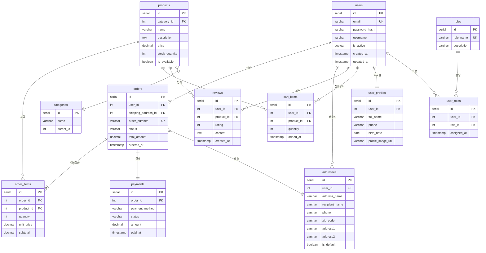

# 사용자 중심 ERD (PostgreSQL)

## 테이블 설명

| 테이블 | 설명 |
|--------|------|
| **users** | 사용자 기본 정보 (로그인 계정) |
| **user_profiles** | 사용자 상세 프로필 (1:1 관계) |
| **addresses** | 사용자 배송지 목록 |
| **roles** | 권한 역할 정의 (admin, user 등) |
| **user_roles** | 사용자-역할 매핑 (다대다) |
| **orders** | 주문 정보 |
| **order_items** | 주문 상세 품목 |
| **payments** | 결제 정보 |
| **products** | 상품 정보 |
| **categories** | 상품 카테고리 (셀프조인으로 계층구조) |
| **cart_items** | 장바구니 |
| **reviews** | 상품 리뷰 |

## 주요 관계

- `users` → `user_profiles` : 1:1 (사용자당 하나의 프로필)
- `users` → `addresses` : 1:N (여러 배송지 등록 가능)
- `users` → `orders` : 1:N (여러 주문 가능)
- `users` ↔ `roles` : N:M (user_roles 중간 테이블)
- `orders` → `order_items` : 1:N (주문당 여러 상품)
- `products` → `categories` : N:1 (카테고리별 상품 분류)
